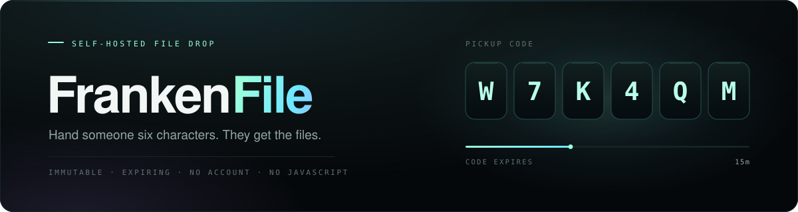

<p align="center">
  
</p>

FrankenFile is a self-hosted file drop. You snapshot files on your server and get
back six characters. Whoever you give them to opens the page, types them in, and
downloads the files — no account, no app, no client-side JavaScript.

The code is a rendezvous, not a password. It is short-lived and rate-limited, and
redeeming it exchanges it for a session that only works for that one drop, on that
one device, until it expires.

[Quick start](#quick-start) ·
[How it works](#how-it-works) ·
[Console](#the-frankendrop-console) ·
[Architecture](docs/architecture.md) ·
[Deployment](docs/deployment.md) ·
[Security](SECURITY.md)

```console
$ frankenfile create ./trip-photos --title "Trip photos"
  Code       W7K4QM
  Share link https://files.example.com/frankenfile/W7K4QM
  Payload    284 MiB across 96 files and 3 folders
  Code until 2026-07-27T19:48:00Z
```

> [!IMPORTANT]
> A live drop is reachable by anyone holding its code, so run this behind a TLS
> reverse proxy, bound to an address the Internet cannot reach directly. Six
> characters buy a short, rate-limited window — not secrecy against a determined
> campaign. Read [SECURITY.md](SECURITY.md) before exposing it.

## What it does

- **Six characters, unambiguous.** Letters and numbers, or digits only when you
  need to read them over the phone. They expire in 15 minutes by default.
- **Redeeming a code trades it for a session.** Random 256-bit, scoped to that
  one drop, HttpOnly, expiring. No plaintext code or token is stored anywhere.
- **What you sent is what they get.** Files are captured into an immutable
  BLAKE3 store, so editing the original afterwards changes nothing.
- **Unsafe sources are refused**: symlinks, devices, sockets, FIFOs, unsafe
  paths, duplicate roots, or a file that changed mid-capture.
- **Any folder downloads as one archive**, deterministic and ZIP64-capable.
- **Interrupted downloads continue** instead of restarting, via HEAD, strong
  ETags, RFC 9530 digests, `If-Range`, 206 resume, and 416 boundaries.
- **Publish from the browser or the CLI.** Both use the same capture pipeline.
- **The receiver page loads nothing from anyone else.** No JavaScript, no
  analytics, no CDN, no third-party fonts, scripts, or images.

## Compared with

FrankenFile is a file drop, not a drive. You publish a fixed set of files, hand
over six characters, and the link expires on its own.

| Compared with | Why use FrankenFile | Use the other tool when |
| --- | --- | --- |
| WeTransfer and other hosted drops | The files stay on your own server. No account, no third party, no upload quota. | You would rather not run anything yourself. |
| [Firefox Send](https://github.com/mozilla/send) | Send was discontinued in 2020; this is maintained, and the receiver page runs no JavaScript at all. | You specifically need Send's browser-side encryption model. |
| [PicoShare](https://github.com/mtlynch/picoshare) or [Pingvin Share](https://github.com/stonith404/pingvin-share) | Immutable BLAKE3 snapshots, resumable downloads, and a receiver page that loads nothing from anyone else. | You want a browser upload UI, accounts, and a long-lived library. |
| Nextcloud or Seafile share links | Nothing to maintain beyond one binary and a SQLite file. | You already run one, or you want sync and collaboration too. |

## Quick start

You need a recent stable Rust toolchain (edition 2024, `rust-version` 1.88).

```sh
git clone https://github.com/mystxcal/frankenfile.git
cd frankenfile
cargo build --release
target/release/frankenfile --data-dir ./state serve --insecure-cookie
```

That serves <http://127.0.0.1:18766/frankenfile> and prints a generated console
password once. `--insecure-cookie` allows a non-Secure session cookie and is for
loopback development only.

Publish something and hand over the code:

```sh
target/release/frankenfile --data-dir ./state create ./some-folder --title "Trip photos"
```

For a real deployment, put it behind TLS and name your own origin — the public URL
must end with the base path:

```sh
frankenfile serve \
  --bind 127.0.0.1:18766 \
  --base-path /frankenfile \
  --public-url https://files.example.com/frankenfile \
  --trusted-proxy 127.0.0.1/32
```

`deploy/` carries a hardened systemd unit, a retention timer, and an example Caddy
site. [Deployment](docs/deployment.md) covers install, credentials, rollback, and
backups.

## How it works

Publication and retrieval are separate. `create` walks the paths you give it with
link-following disabled, opens regular files with `O_NOFOLLOW`, checks device and
inode metadata before and after copying, streams each file once through BLAKE3 and
SHA-256, and only then commits a lexically sorted manifest in a single SQLite
transaction. Source paths are never served, and after this point the drop is
frozen.

Retrieval starts at the code. Codes are stored as keyed tags, never plaintext, and
guessing them burns a persistent global and per-source failure budget that survives
restarts. Wrong, expired, exhausted, revoked, and throttled attempts all return the
same page, the same status, and an overlapping timing envelope, so a failure never
says *which* kind of failure it was. A successful redemption sets a random 256-bit
capability scoped to that drop; every byte after that is selected from an
authorized database row rather than from a path in the request.

ZIPs are immutable cached representations keyed to the manifest, not live streams,
which is what makes ranges, resume, and strong validators honest for archives too.

Expiry is real: codes, drops, and sessions each end on their own schedule, and `gc`
reclaims the bytes afterwards behind a recovery grace period.

## Creating drops

```sh
frankenfile create /path/to/file /path/to/folder --title "Trip photos"
frankenfile --json create /path/to/folder --title "Build 42"
```

The output carries the pickup code, share link, drop ID, exact expiry times, size
and count summary, and the manifest fingerprint. **The code is shown once.** Use
`--numeric-code` when someone will read it aloud.

Defaults are a 15-minute code, a 24-hour drop, and a 24-hour device session;
`--code-ttl`, `--drop-ttl`, and `--max-redemptions` narrow that. TTLs accept values
like `5m`, `12h`, `3d`.

Every code doubles as a share link. `/frankenfile/W7K4QM` opens the receiver page
with the code filled in, so the recipient just presses **Open files**. The link
deliberately does not auto-redeem: a GET never spends a redemption, so link-preview
bots in chat and mail crawl it harmlessly and it is useless as a validity oracle.
Redemption always goes through the same rate-limited POST as typing it by hand.

If a code expires before its drop does, or never reached anyone, reissue it. The
old code dies immediately; devices that already redeemed keep their access:

```sh
frankenfile recode DROP_ID_OR_UNIQUE_PREFIX --code-ttl 1h
```

## The FrankenDrop console

`/frankenfile/drop` publishes drops from a browser, for when you do not have a
shell. Unlocking it with the operator password (`--admin-password` /
`FRANKENFILE_ADMIN_PASSWORD`) mints a 30-minute HttpOnly admin session; wrong
attempts are compared in constant time and charged to the same failure budget as
code redemption. No password ships with the source — when none is configured, one
is generated at startup and printed once, so an unconfigured instance is never
open.

Unlocked, it lists every active drop most-urgent-first with live status pills —
code live or expired, time left, expiring items flagged — and gives each row a
one-click reissue and a revoke behind a confirm step. Uploads stream into the
private state directory and publish through the identical immutable pipeline the
CLI uses, capped by `--max-upload-bytes` (2 GiB by default). Every action also
accepts the password in-form, so `curl -F` works against `/drop`, `/drop/recode`,
and `/drop/revoke`.

## Fetching from the CLI

Scripts and agents can redeem a link, download the bundle, and extract it into a
content-addressed local cache:

```sh
frankenfile get 'https://files.example.com/frankenfile/W7K4QM'
frankenfile --json get W7K4QM
```

It prints the extracted directory, counts, bundle SHA-256, and whether the result
came from cache. It accepts only the configured origin and base path, refuses
redirects elsewhere, bounds both downloaded and extracted bytes, and rejects unsafe
ZIP paths, duplicate entries, and special files. Use `--output` for a fixed
destination; the default cache lives under `/tmp`.

## Lifecycle

```sh
frankenfile list                  # active drops
frankenfile show DROP_ID          # manifest and lifecycle, never the code
frankenfile revoke DROP_ID        # kill the drop and every session, now
frankenfile doctor --deep         # verify database and object-store integrity
frankenfile gc                    # dry run, seven-day recovery grace
frankenfile gc --execute          # purge eligible metadata and bytes
```

## Development

```sh
cargo fmt --all -- --check
cargo clippy --all-targets -- -D warnings
cargo test --all-targets
cargo audit
cargo build --release
```

`scripts/visual-audit.mjs` screenshots the receiver and drop pages at desktop and
mobile widths and reports overflow, focus, and console errors. It uses the system
Chrome plus a throwaway Playwright Core install under `test-output/`, and is not
part of the production build.

## Security

Report vulnerabilities privately — see [SECURITY.md](SECURITY.md). The assets,
adversaries, invariants, and accepted residual risks are enumerated in
[docs/threat-model.md](docs/threat-model.md).

## Related

Same idea, different job — one thing done properly, nothing in the middle,
and a result you can check:

- [RIFT](https://github.com/mystxcal/rift) — send a file straight to someone while you are both online
- [Remote Browser](https://github.com/mystxcal/remote-browser) — Chromium on your server, rebuilt as a scriptless page

The rest are listed on [my profile](https://github.com/mystxcal).

## License

MIT — see [LICENSE](LICENSE).
